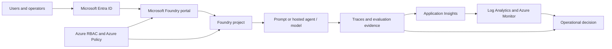

# Foundry Governance and Observability Workshop

## PowerPoint-ready slide content

**Primary experience:** NEW Microsoft Foundry portal at `https://ai.azure.com`  
**Platform grounding:** Microsoft Foundry plus Azure services  
**Audience:** Technical sellers, solution engineers, cloud architects, AI platform owners, and customer technical decision makers  
**Format:** Customer-facing presentation, portal demo, and guided hands-on lab  
**Duration:** 4 hours / 240 minutes

> **Scope guardrail:** Agent 365 is out of scope and is not required for this workshop. Do not include Agent 365 demos, lab steps, dependencies, licensing assumptions, or screenshots.

## Deck design direction

- **Visual language:** Premium technical; dark navy title/divider slides, warm off-white content slides, Azure blue and teal accents.
- **Motif:** A continuous evidence path: **Govern -> Run -> Observe -> Evaluate -> Decide**.
- **Typography:** Aptos Display or Segoe UI Semibold for titles; Aptos or Segoe UI for body copy.
- **Content rule:** Keep slide text concise; use speaker notes for nuance, caveats, and customer examples.
- **Portal rule:** Use screenshots or live views from the **NEW Microsoft Foundry portal**. Add the verification note wherever labels or navigation may change.

---

## Slide 1 — Foundry Governance and Observability Workshop

**Subtitle / key message:** Move from AI experimentation to a governed, observable, and repeatable operating model.

**Bullets**

- Govern access, deployments, safety controls, and project boundaries.
- Observe behavior through traces, logs, metrics, and evaluations.
- Connect quality and safety evidence to lifecycle decisions.
- Practice the workflow in the **NEW Microsoft Foundry portal**.

**Speaker notes**

Set the expectation that this is an operational-readiness workshop, not an AI hype session. The goal is to connect architecture, governance, evaluation, and operations into one practical customer conversation. State that Agent 365 is out of scope and not required.

**Suggested visual**

Dark cover with a circular evidence path: **Govern → Run → Observe → Evaluate → Decide**. Place a subtle **NEW Microsoft Foundry portal** browser-frame placeholder on the right.

**Demo or lab tie-in**

Preview the final outcome: a Foundry project, a working prompt scenario, trace evidence, an evaluation result, and a readiness decision.

**Portal verification note**

Use a current screenshot of the **NEW Microsoft Foundry portal** landing experience. **Verify in the current Microsoft Foundry portal** before capturing.

---

## Slide 2 — Audience, prerequisites, and participation modes

**Subtitle / key message:** The workshop brings platform, engineering, security, and operations perspectives into one working session.

**Bullets**

- Azure subscription and supported Microsoft Entra tenant access.
- Permission to open a prepared Foundry project; elevated permissions are optional.
- Approved model deployment or instant-access model.
- Application Insights and Log Analytics access for telemetry review.
- Build, shared-project, and review-only participation modes are supported.

**Speaker notes**

Explain that participants do not need identical permissions. Builders can create or modify eligible assets, shared-project teams work in an instructor-prepared environment, and review-only participants can inspect evidence and make recommendations. Do not distribute shared credentials or API keys.

**Suggested visual**

Three-column participation matrix: **Build**, **Shared project**, **Review only**, with role icons and permitted activities.

**Demo or lab tie-in**

Direct participants to Lab Module 1, Environment and access validation.

**Portal verification note**

Show project access in the **NEW Microsoft Foundry portal** without presenting a fixed navigation path. **Verify in the current Microsoft Foundry portal**.

---

## Slide 3 — Workshop goals

**Subtitle / key message:** Leave with an actionable governance and observability pattern, not just a successful prompt.

**Bullets**

- Explain the Microsoft Foundry resource and project model.
- Identify governance controls across identity, policy, networking, data, and safety.
- Capture and interpret traces, logs, metrics, and evaluation outputs.
- Apply quality and safety criteria before and after deployment.
- Define owners, thresholds, evidence, and escalation paths.

**Speaker notes**

Emphasize that “the prompt worked” is not a production-readiness result. A successful outcome includes evidence that the experience is secure, measurable, supportable, and ready for controlled change.

**Suggested visual**

Five outcome cards connected by a maturity arrow: **Understand → Govern → Observe → Evaluate → Operate**.

**Demo or lab tie-in**

Each goal maps to a validation check in the hands-on lab.

**Portal verification note**

Use current portal-native examples for project, compliance, tracing, and evaluation views. **Verify in the current Microsoft Foundry portal**.

---

## Slide 4 — Why governance and observability matter for AI applications

**Subtitle / key message:** AI applications combine probabilistic behavior with conventional cloud risks.

**Bullets**

- Outputs can vary while infrastructure remains healthy.
- Prompts, context, tools, and model versions affect behavior.
- Quality, safety, latency, cost, and availability can regress independently.
- Telemetry may contain sensitive input, output, or tool data.
- Production decisions require evidence, ownership, and repeatable gates.

**Speaker notes**

Contrast traditional service monitoring with AI behavior monitoring. A successful HTTP response does not prove that an answer was grounded, relevant, safe, or useful. Governance defines acceptable behavior; observability supplies evidence.

**Suggested visual**

Two-axis chart: **System health** on one axis and **AI response quality** on the other. Highlight the “healthy infrastructure, poor answer” quadrant.

**Demo or lab tie-in**

Later, compare a technically successful request with a low-quality or policy-sensitive response.

**Portal verification note**

Use current trace and evaluation evidence from the **NEW Microsoft Foundry portal**. **Verify in the current Microsoft Foundry portal**.

---

## Slide 5 — The customer operating questions

**Subtitle / key message:** Start with the questions owners and operators need answered every day.

**Bullets**

- Who can build, deploy, invoke, evaluate, and administer?
- Which project, resource, region, model, and data boundary are in use?
- What happened during an interaction, and how long did it take?
- Was the response useful, grounded, safe, and policy-compliant?
- What evidence is required before release or after an incident?

**Speaker notes**

Use these questions as the narrative spine for the rest of the deck. Each question maps to a Foundry or Azure evidence surface and to a lab output.

**Suggested visual**

Five question cards arranged around a central customer scenario: **Support Policy Assistant**.

**Demo or lab tie-in**

Participants answer the same questions using their project inventory, traces, evaluation results, and readiness scorecard.

**Portal verification note**

Keep the question model stable, but use current **NEW Microsoft Foundry portal** views for the evidence examples. **Verify in the current Microsoft Foundry portal**.

---

## Slide 6 — Section divider: Microsoft Foundry as the operating surface

**Subtitle / key message:** One experience for building, governing, observing, and evaluating AI solutions.

**Bullets**

- Microsoft Foundry is the center of the workshop.
- Azure provides identity, policy, monitoring, data, and network foundations.
- The **NEW Microsoft Foundry portal** is the primary user experience.

**Speaker notes**

Transition from the “why” to the “where.” Explain that the workshop does not treat governance as a separate security review or observability as a dashboard exercise. Both are part of the delivery lifecycle.

**Suggested visual**

Full-bleed **NEW Microsoft Foundry portal** browser frame with four labeled zones: **Build**, **Govern**, **Observe**, **Evaluate**.

**Demo or lab tie-in**

Begin the live portal orientation immediately after this divider.

**Portal verification note**

Use a current **NEW Microsoft Foundry portal** screen. **Verify in the current Microsoft Foundry portal**.

---

## Slide 7 — Microsoft Foundry positioning

**Subtitle / key message:** Microsoft Foundry connects AI development and operational governance around shared project context.

**Bullets**

- Projects provide a practical development and asset boundary.
- Models, agents, evaluations, traces, and connections become reviewable assets.
- Azure services extend identity, policy, telemetry, data, and security controls.
- Teams can move from experimentation to evidence-based operations.

**Speaker notes**

Position Microsoft Foundry as the working environment for AI application teams and platform owners. Avoid presenting it as a replacement for Azure governance; instead, show how Foundry and Azure controls fit together.

**Suggested visual**

Layered model: **Microsoft Foundry portal** on top of **Foundry resource and projects**, with Azure platform services underneath.

**Demo or lab tie-in**

Show the assigned project and explain which evidence will be created during the lab.

**Portal verification note**

Use the current **NEW Microsoft Foundry portal** terminology and project model. **Verify in the current Microsoft Foundry portal**.

---

## Slide 8 — NEW Microsoft Foundry portal orientation

**Subtitle / key message:** Teach outcomes and work areas, not memorized click paths.

**Bullets**

- Establish project context first using the upper-left project selector.
- **Build** creates: Agents, Deployments, Services, Tools, Knowledge, Guardrails, Memory, Data.
- **Build** optimizes: Evaluations and Fine-tune.
- **Operate** governs: Compliance (Policies, Assets, Guardrails, Security posture).
- **Manage** administers: Project details, Users, Connected resources. **Discover** browses the catalog.

**Speaker notes**

Walk the top-level areas — **Home**, **Discover**, **Build**, **Operate**, **Manage** — then show the Build left pane grouped into **Create** and **Optimize**. Note that model deployments live under **Build** > **Deployments** (not a "Models" node in the left pane), and evaluations live under **Build** > **Evaluations**. Open a deployment to show the details pane with **Open in playground**, **Project endpoint**, **API Key**, and **Call this model** sample code — a natural moment to make the key-versus-Entra point. Confirm the **New Foundry** toggle is on. Labels can evolve; frame each workflow by outcome: select a project, review access, inspect compliance, locate traces, run an evaluation.

**Suggested visual**

Annotated **NEW Microsoft Foundry portal** screenshot of the **Build** area showing the top navigation and the left pane **Create**/**Optimize** groups, with a "verify current navigation" badge.

**Demo or lab tie-in**

This slide is the navigation reference for Lab Modules 2, 3, 6, and 8.

**Portal verification note**

**Verify in the current Microsoft Foundry portal** immediately before delivery. Do not publish a fixed click path in participant materials.

---

## Slide 9 — Resource and project model

**Subtitle / key message:** Governance starts by knowing which boundary owns which decision.

**Bullets**

- The Foundry resource is the top-level Azure resource boundary.
- A Foundry project organizes people, assets, evaluations, and runtime work.
- Model deployments and connected resources may have separate ownership.
- Storage, Key Vault, AI Search, Application Insights, and Log Analytics remain Azure boundaries.
- Region, subscription, resource group, and project context must be recorded.

**Speaker notes**

Use a concrete example: a project team may own prompts and evaluations, while a platform team owns the Foundry resource, model deployments, and monitoring workspace. Make the ownership boundary visible before discussing permissions.

**Suggested visual**

Nested boundary diagram: Subscription → Resource group → Foundry resource → Foundry project, with connected Azure resources shown as adjacent governed boundaries.

**Demo or lab tie-in**

Participants record the parent resource, project, region, and connected-resource owners in Lab Module 2.

**Portal verification note**

Use current project details and connected-resource views. **Verify in the current Microsoft Foundry portal**.

---

## Slide 10 — Section divider: Governance foundations

**Subtitle / key message:** Govern the identity, data, deployment, network, and safety decisions that shape AI behavior.

**Bullets**

- Identity and access
- Policy and compliance
- Network and data boundaries
- Model deployment and safety controls

**Speaker notes**

Transition from portal orientation to governance. Reinforce that governance is not a single setting; it is a system of controls, evidence, owners, exceptions, and review dates.

**Suggested visual**

Four-pillar graphic around a governed Foundry project.

**Demo or lab tie-in**

Introduce Lab Modules 3 and 4.

**Portal verification note**

Use current governance views from the **NEW Microsoft Foundry portal**. **Verify in the current Microsoft Foundry portal**.

---

## Slide 11 — Identity, RBAC, and least privilege

**Subtitle / key message:** Access must be scoped to the actions and resources a role actually needs.

**Bullets**

- Use Microsoft Entra groups and managed identities where possible.
- Scope access at the Foundry resource, project, or Azure resource level.
- Separate project access from Application Insights and Log Analytics access.
- Review current Microsoft Foundry role display names and definition IDs.
- Keep administration and production access distinct.

**Speaker notes**

Explain that a user may be able to build in a Foundry project but not query production traces. Role names can change across surfaces, so validate current labels and prefer stable role definition IDs in automation.

**Suggested visual**

Least-privilege ladder: **Viewer → Builder → Evaluator → Operator → Administrator**, mapped to Foundry and Azure scopes.

**Demo or lab tie-in**

Review access without changing assignments in Lab Module 3.

**Portal verification note**

Review **Manage** > **Project details** > **Users** and current Foundry role labels. **Verify in the current Microsoft Foundry portal**. Validate role naming against current Microsoft Learn documentation.

---

## Slide 12 — Policy, compliance, and guardrails

**Subtitle / key message:** A safety control becomes governance when it is scoped, measurable, owned, and reviewable.

**Bullets**

- Review policy compliance and available asset or guardrail findings.
- Use Azure Policy-backed controls where supported.
- Review content filtering, prompt shields, abuse monitoring, and related controls.
- Track violations, exceptions, remediation owners, and review dates.
- Keep policy authoring separate from workshop review activities.

**Speaker notes**

Distinguish configuration from governance. A configured control is not enough; the customer also needs a minimum standard, scope, compliance state, exception process, remediation owner, and evidence.

**Suggested visual**

Compliance loop: **Define → Assign → Assess → Remediate → Reassess**.

**Demo or lab tie-in**

Inspect compliance and guardrail evidence in Lab Module 3 and discuss responsible AI controls in Module 9.

**Portal verification note**

Use the current compliance experience and available views. **Verify in the current Microsoft Foundry portal**. Validate tab names and Azure Policy coverage before delivery.

---

## Slide 13 — Network, data, and deployment governance

**Subtitle / key message:** Model choice is only one part of the governance decision.

**Bullets**

- Confirm model and feature availability in `<REGION>`.
- Choose deployment type and data-processing scope intentionally.
- Review public access, private networking, outbound access, and DNS requirements.
- Apply retention, encryption, and access controls to telemetry and connected data.
- Treat network-isolated and preview scenarios as explicit validation items.

**Speaker notes**

Avoid promising feature parity across regions or isolated-network configurations. Record assumptions about region, deployment type, data residency, network connectivity, and telemetry support.

**Suggested visual**

Decision tree: **Region → Deployment type → Network boundary → Data boundary → Evidence retention**.

**Demo or lab tie-in**

Participants review deployment metadata and connected resources without changing production networking.

**Portal verification note**

Use current project and deployment details. **Verify in the current Microsoft Foundry portal** and current region-support documentation.

---

## Slide 14 — Responsible AI and safety by design

**Subtitle / key message:** Responsible AI is a continuous operating discipline, not a launch-day checklist.

**Bullets**

- Discover risks before implementation and testing.
- Protect users and data with identity, safety, and application controls.
- Govern behavior with evaluations, monitoring, escalation, and human review.
- Test ambiguity, prompt injection, sensitive-data requests, and harmful outcomes.
- Document refusal, clarification, escalation, and incident pathways.

**Speaker notes**

Use the support-policy scenario to make safety practical. The assistant should answer from supplied policy, state uncertainty, ask clarifying questions, avoid exposing sensitive data, and escalate ambiguous or unsupported decisions.

**Suggested visual**

Three-layer shield: **Discover → Protect → Govern**, with examples around each layer.

**Demo or lab tie-in**

Run normal, ambiguous, and adversarial prompts in Module 5; map risks to controls in Module 9.

**Portal verification note**

Use current safety and guardrail views in the **NEW Microsoft Foundry portal**. **Verify in the current Microsoft Foundry portal**.

---

## Slide 15 — Section divider: Observability and evaluation

**Subtitle / key message:** Observe what happened, evaluate whether it was good, and connect both to decisions.

**Bullets**

- Traces explain execution.
- Logs and metrics explain operations.
- Evaluations explain quality and safety.
- Lifecycle gates explain what happens next.

**Speaker notes**

Make the distinction explicit: traces answer “what happened?” Evaluations answer “was it good enough?” Governance answers “who decides what happens next?”

**Suggested visual**

Three evidence streams converging into a decision gate: **Trace + Telemetry + Evaluation → Release / Remediate / Escalate**.

**Demo or lab tie-in**

Introduce Lab Modules 6 through 9.

**Portal verification note**

Use current observability and evaluation experiences. **Verify in the current Microsoft Foundry portal**.

---

## Slide 16 — Telemetry architecture

**Subtitle / key message:** Azure Monitor extends Foundry evidence into operational analysis and response.

**Bullets**

- Application Insights stores and correlates application and trace telemetry.
- Log Analytics supports queries, access control, and retention.
- Azure Monitor metrics track volume, latency, errors, and consumption.
- Alerts need an owner, threshold, severity, and response action.
- Redaction, sampling, retention, and cost controls are part of observability governance.

**Speaker notes**

Do not collect everything by default. Define the purpose of each signal and protect telemetry because prompts, outputs, and tool data may be sensitive. Foundry access does not automatically grant access to every monitoring resource.

**Suggested visual**

Telemetry pipeline from Microsoft Foundry → Application Insights → Log Analytics → dashboards and alerts.

**Demo or lab tie-in**

Start in the Foundry trace and optionally hand off to Azure Monitor for deeper analysis in Module 7.

**Portal verification note**

Start from the **NEW Microsoft Foundry portal** trace and use Azure Monitor as a supporting surface. **Verify in the current Microsoft Foundry portal**.

---

## Slide 17 — Traces: understand the execution

**Subtitle / key message:** Tracing reveals sequence, timing, status, and sensitive-data exposure.

**Bullets**

- Inspect spans for prompts, model calls, orchestration, retrieval, and tools.
- Review duration, status, errors, and correlation identifiers.
- Use traces to investigate latency and failure patterns.
- Protect trace content with access, retention, and redaction controls.
- Treat availability and retention as current feature-validation items.
- **Trace Replay (preview)** can show User and Trajectories views, span timing/token cost, filters, and playthrough.

**Speaker notes**

Tracing is a low-friction diagnostic starting point, but it does not prove quality. Explain that supported scenarios and preview coverage can change. If enabled, demonstrate Trace Replay as an optional troubleshooting aid; otherwise use a prepared trace. Mark the capability **Preview / validate before delivery** and do not make it a lab blocker.

**Suggested visual**

Waterfall trace with labeled spans: input → orchestration → model → retrieval/tool → output.

**Demo or lab tie-in**

Participants locate a Module 5 interaction, record the trace ID, and identify the slowest span.

**Portal verification note**

Use the current tracing experience inside the **NEW Microsoft Foundry portal**. **Verify in the current Microsoft Foundry portal** and validate GA/preview scope and retention.

---

## Slide 18 — Evaluations: measure what “good” means

**Subtitle / key message:** Evaluations turn subjective expectations into repeatable evidence.

**Bullets**

- Select a target: model, Foundry agent, dataset, or eligible traces.
- Use normal, edge, failure, and adversarial scenarios.
- Measure quality, safety, task behavior, and business-specific criteria.
- Version prompts, models, datasets, evaluators, and thresholds.
- Compare results over time and connect them to release decisions.
- **Trace evaluation (preview)** can score Application Insights traces by trace ID or agent filter without replaying production requests.

**Speaker notes**

Evaluation availability depends on target, scope, data, region, and feature status. Treat AI-assisted evaluators as measurements with limitations; pair them with representative data, deterministic checks, and human review. Trace evaluation, conversation-level evaluation, and synthetic-data evaluation are preview or scope-dependent; use prepared results when prerequisites are missing.

**Suggested visual**

Evaluation pipeline: **Dataset → Target → Evaluators → Results → Release gate**.

**Demo or lab tie-in**

Run or review a small evaluation in Module 8 using `<EVALUATION_DATASET>`.

**Portal verification note**

Use the current evaluation creation experience or target entry point in the **NEW Microsoft Foundry portal**. **Verify in the current Microsoft Foundry portal** and validate evaluator availability.

---

## Slide 19 — Lifecycle management and release gates

**Subtitle / key message:** Every material change should pass a defined evidence gate.

**Bullets**

- **Intake:** use case, owner, data classification, risk tier, and region.
- **Build:** approved models, identities, connections, guardrails, and logging.
- **Validate:** functional, quality, safety, security, performance, and cost tests.
- **Release:** approval, version record, thresholds, rollback, and support readiness.
- **Operate:** monitoring, incident response, periodic evaluation, and retirement.
- **Preview path:** recurring evaluations, intelligent sampling, and alerts may extend the operate stage when enabled.

**Speaker notes**

Treat prompts, grounding data, models, deployments, guardrails, and evaluator settings as versioned configuration. Define which changes require full reevaluation. Recurring evaluations and alerts are preview capabilities and must have validated thresholds, owners, and fallback procedures.

**Suggested visual**

Stage-gate lifecycle with evidence artifacts beneath each stage.

**Demo or lab tie-in**

Participants use trace and evaluation results to make a Pass, Conditional pass, or Fail recommendation.

**Portal verification note**

Use current evaluation history and project assets as evidence in the **NEW Microsoft Foundry portal**. **Verify in the current Microsoft Foundry portal**.

---

## Slide 20 — Reference architecture

**Subtitle / key message:** Governance controls and observability signals surround the runtime path.

**Bullets**

- Microsoft Entra ID authenticates users, applications, and managed identities.
- Microsoft Foundry provides projects, models, agents, evaluations, and traces.
- Azure Policy and RBAC govern scope, posture, and access.
- Application Insights, Log Analytics, and Azure Monitor provide operational evidence.
- Human owners use evidence to approve, remediate, escalate, or retire.

**Speaker notes**

Walk left to right: identity and governance establish boundaries; the application runs through Foundry; telemetry and evaluations produce evidence; owners make decisions. Connected services retain separate Azure governance responsibilities.

**Suggested visual**

**Demo or lab tie-in**

Use this architecture as the map for the demo and the lab evidence checklist.

**Portal verification note**

Keep the **NEW Microsoft Foundry portal** at the center of the architecture visual. **Verify in the current Microsoft Foundry portal** before replacing the placeholder with a screenshot.

---

## Slide 21 — Section divider: Instructor demo

**Subtitle / key message:** Demonstrate the operating questions in the order a customer would investigate them.

**Bullets**

- Establish project context.
- Review access and compliance.
- Run a normal and challenging interaction.
- Inspect a trace and evaluation.
- Make an operational decision.

**Speaker notes**

The demo is not a feature tour. It is a short customer story: “Can we prove this AI experience is governed, observable, and ready for controlled change?”

**Suggested visual**

Five-step horizontal demo path with a live-portal screenshot placeholder.

**Demo or lab tie-in**

The demo mirrors Lab Modules 2 through 9.

**Portal verification note**

Use only the **NEW Microsoft Foundry portal** as the primary demo surface. **Verify in the current Microsoft Foundry portal** immediately before delivery.

---

## Slide 22 — Demo flow and talk track

**Subtitle / key message:** Move from context to evidence to decision in 25–30 minutes.

**Bullets**

- **Context:** Open `https://ai.azure.com` and establish project, resource, subscription, and region.
- **Govern:** Review administration, access, compliance, deployment, and safety context.
- **Run:** Execute a normal prompt and a challenging prompt using synthetic data.
- **Observe:** Inspect the trace and optionally correlate with Azure Monitor.
- **Evaluate and decide:** Review results and assign Pass, Conditional pass, or Fail.

**Speaker notes**

Pause after each evidence surface and ask: “What customer question does this answer?” If a live step is unavailable, use a sanitized screenshot and explain what the audience should look for. Never improvise a legacy path.

**Suggested visual**

Storyboard with six frames: portal → access → compliance → prompt → trace → evaluation scorecard.

**Demo or lab tie-in**

Participants repeat this same sequence during the hands-on modules.

**Portal verification note**

All portal actions must be captured from the **NEW Microsoft Foundry portal**. **Verify in the current Microsoft Foundry portal**. Use prepared screenshots if a capability is unavailable.

---

## Slide 23 — Section divider: Four-hour hands-on lab

**Subtitle / key message:** Build evidence as you move through the lifecycle.

**Bullets**

- Validate access and environment.
- Establish project and governance context.
- Run a scenario and capture telemetry.
- Evaluate behavior and make a readiness decision.

**Speaker notes**

Set the expectation that participants will work in build, shared-project, or review-only mode. The lab is designed to produce artifacts and decisions, not just clicks.

**Suggested visual**

Lab journey with checkpoints and evidence icons.

**Demo or lab tie-in**

Transition directly to the agenda slide.

**Portal verification note**

The lab’s central surface is the **NEW Microsoft Foundry portal**. **Verify in the current Microsoft Foundry portal** before delivery.

---

## Slide 24 — Four-hour workshop agenda

**Subtitle / key message:** 240 minutes balances instruction, evidence-building, breaks, and discussion.

**Bullets**

- **10 min:** Welcome and objectives
- **15 min:** **NEW Microsoft Foundry portal** orientation
- **20 min:** Governance foundations
- **20 min:** Observability foundations
- **15 min:** Hands-on setup
- **40 min:** Lab A — project and governance
- **10 min:** Break
- **40 min:** Lab B — prompt and observability
- **35 min:** Lab C — evaluation and safety
- **10 min:** Break
- **10 min:** Cleanup and next steps
- **15 min:** Wrap-up and discussion

**Speaker notes**

Call out the design balance: 150 minutes of hands-on work and 90 minutes of instruction, setup, breaks, cleanup, and discussion. Keep a troubleshooting desk active during breaks.

**Suggested visual**

Horizontal timeline with color-coded segments: instruction, hands-on, break, and decision.

**Demo or lab tie-in**

This is the run-of-show for the instructor and participants.

**Portal verification note**

The orientation and all hands-on segments use the **NEW Microsoft Foundry portal**. **Verify in the current Microsoft Foundry portal** before updating screenshots or captions.

---

## Slide 25 — Lab modules

**Subtitle / key message:** Ten modules move from access validation to cleanup and next actions.

**Bullets**

- **1. Environment and access validation** — confirm subscription, roles, project, deployment, and monitoring access.
- **2. Create or open a Foundry project** — establish project and resource context.
- **3. Review governance and project structure** — inspect access, compliance, assets, and connected resources.
- **4. Review deployment and access controls** — record model, region, capacity, and safety assumptions.
- **5. Run a prompt scenario** — use synthetic support-policy context.
- **6–7. Capture traces and review observability** — inspect Foundry traces and Azure Monitor evidence.
- **8–9. Evaluate and discuss safety** — run evaluation and map risks to controls.
- **10. Cleanup and next steps** — delete or document retained resources.

**Speaker notes**

Remind participants that each module has an expected result, validation checklist, common issues, and fixes. Agent 365 is out of scope and not required for any module.

**Suggested visual**

Ten numbered cards grouped into four phases: **Prepare → Govern → Observe → Decide**.

**Demo or lab tie-in**

Use this slide as the lab navigation board.

**Portal verification note**

Module entry points and labels must be checked in the **NEW Microsoft Foundry portal**. **Verify in the current Microsoft Foundry portal**.

---

## Slide 26 — Lab outputs and validation evidence

**Subtitle / key message:** Participants leave with evidence that can support a production-readiness conversation.

**Bullets**

- Project and deployment inventory with owners and boundaries.
- Access and governance review with recorded findings.
- Synthetic prompt results, including normal and challenging cases.
- Trace ID, duration, slowest span, errors, and sensitive-data observations.
- Evaluation result, safety control map, readiness decision, and cleanup record.

**Speaker notes**

Make the output tangible. The goal is not to create a perfect production system in four hours; it is to demonstrate the evidence and operating model required to improve one responsibly.

**Suggested visual**

Evidence pack folder with six artifact cards: inventory, access, prompt, trace, evaluation, cleanup.

**Demo or lab tie-in**

Collect these artifacts during the final debrief.

**Portal verification note**

Capture portal evidence only from the **NEW Microsoft Foundry portal** and approved Azure supporting surfaces. **Verify in the current Microsoft Foundry portal**.

---

## Slide 27 — Key takeaways

**Subtitle / key message:** Governance and observability are operating capabilities, not separate checklists.

**Bullets**

- Establish project, resource, identity, region, and data context first.
- Govern access, deployments, safety, and connected Azure resources explicitly.
- Use traces to understand execution and evaluations to judge behavior.
- Protect telemetry and connect signals to owners, thresholds, and actions.
- Treat every material change as a versioned, evidence-based decision.

**Speaker notes**

Ask participants to name one control they would standardize, one signal they would monitor, and one evaluation they would require for their own scenario.

**Suggested visual**

Five takeaway tiles around a central “operational readiness” badge.

**Demo or lab tie-in**

Use participant findings from the readiness scorecard.

**Portal verification note**

End with a current **NEW Microsoft Foundry portal** view showing project context and operational evidence. **Verify in the current Microsoft Foundry portal**.

---

## Slide 28 — Next steps and recommended follow-up actions

**Subtitle / key message:** Turn the workshop pattern into a governed customer pilot.

**Bullets**

- Select one representative AI use case and define its risk tier.
- Assign platform, security, application, data, and operations owners.
- Standardize project, identity, deployment, telemetry, and evaluation controls.
- Define release thresholds, incident triggers, and evidence-retention rules.
- Schedule a 30-day production-readiness review using the workshop scorecard.

**Speaker notes**

Close with a practical sequence: **Pilot → Prove → Scale**. Recommend that the follow-up review validate current Microsoft Foundry portal capabilities, region support, role labels, evaluator availability, network assumptions, and telemetry access.

**Suggested visual**

Three-stage action roadmap with dates: **Pilot this month → Prove with evidence → Scale reusable controls**.

**Demo or lab tie-in**

Participants complete the next-action field in the cleanup and readiness record.

**Portal verification note**

Use a current **NEW Microsoft Foundry portal** screenshot for the closing slide. **Verify in the current Microsoft Foundry portal** before delivery.

---

## Appendix slide A — Delivery-day portal verification checklist

**Subtitle / key message:** Refresh fast-moving UI content before every customer delivery.

**Bullets**

- Confirm the **NEW Microsoft Foundry portal** experience at `https://ai.azure.com`.
- Confirm current top-level work areas and project-selection labels.
- Confirm administration, compliance, tracing, and evaluation entry points.
- Confirm current model, deployment, guardrail, and Application Insights connection views.
- Replace screenshots within 48 hours of delivery.

**Speaker notes**

This is an instructor-only checklist. If a label differs, update the slide or say “Verify in the current Microsoft Foundry portal.” Never substitute a remembered legacy path.

**Suggested visual**

Checklist with green, amber, and red status markers.

**Demo or lab tie-in**

Run this checklist during demo preflight and Lab Module 1 setup.

**Portal verification note**

Every item is a **NEW Microsoft Foundry portal** verification item. **Verify in the current Microsoft Foundry portal**.

---

## Appendix slide B — Customer conversation prompts

**Subtitle / key message:** Use operational questions to move from feature discussion to customer value.

**Bullets**

- Which identities can change the model, prompt, data, or guardrail?
- Which signals prove the application is healthy and useful?
- Which evaluation failures block release?
- Who owns remediation when quality, safety, latency, or cost regresses?
- What evidence must be retained for audit, incident response, or review?

**Speaker notes**

Use these prompts in executive briefings, architecture reviews, and follow-up workshops. They keep the conversation grounded in outcomes rather than product menus.

**Suggested visual**

Conversation-card layout with five prompts and owner icons.

**Demo or lab tie-in**

Use the prompts during the wrap-up and customer action-planning discussion.

**Portal verification note**

Use current **NEW Microsoft Foundry portal** evidence to answer the questions. **Verify in the current Microsoft Foundry portal**.

---

## Appendix slide C — Official validation sources

**Subtitle / key message:** Validate fast-moving capabilities against current Microsoft documentation.

**Bullets**

- What is Microsoft Foundry?
- Microsoft Foundry architecture and project model.
- Create and manage Microsoft Foundry projects.
- Compliance, security, RBAC, and responsible AI guidance.
- Tracing, evaluations, region support, and Azure Monitor guidance.
- Current preview references: Trace Replay, trace-to-dataset generation, Agent Monitoring Dashboard, cloud evaluation, and cloud AI red teaming.

**Speaker notes**

Keep the source list in the instructor copy and refresh it before delivery. Validate portal navigation, feature availability, preview status, role names, regional support, evaluator coverage, network-isolation limitations, and telemetry retention.

**Suggested visual**

Source stack with Microsoft Learn and Microsoft Foundry portal icons.

**Demo or lab tie-in**

Use the sources to resolve any portal or feature variance before starting the lab.

**Portal verification note**

Documentation validation must include the live **NEW Microsoft Foundry portal**. **Verify in the current Microsoft Foundry portal**.

---

## Final presenter checklist

- [ ] The **NEW Microsoft Foundry portal** is the primary experience on every workflow slide.
- [ ] Azure services are clearly identified as supporting platform boundaries.
- [ ] Agent 365 is absent from demos, lab dependencies, prerequisites, and assumptions.
- [ ] Every UI-dependent slide includes a current-portal verification note.
- [ ] Screenshots use synthetic or sanitized data only.
- [ ] The 4-hour agenda totals 240 minutes.
- [ ] The lab includes setup validation, troubleshooting, evidence capture, and cleanup.
- [ ] Preview features are labeled **Preview / validate before delivery** and have prepared fallbacks.
- [ ] Current Microsoft Learn documentation and portal navigation were validated before delivery.

---

## Appendix slide D — Portal topic coverage and lab task map

**Subtitle / key message:** Every important portal topic becomes either a participant task, a guided review, or a release-design exercise.

**Bullets**

- **Observability:** Overview, Monitoring, Tracing, and Troubleshooting are covered through signal mapping, telemetry review, trace inspection, and seeded-failure diagnosis.
- **Evaluation:** Rate limits and regions, transparency, supported evaluators, and running evaluations are covered through availability checks and a small evaluation run.
- **Evaluation maturity:** Optimization, AI red teaming, and CI/CD evaluation gates are covered through comparison, adversarial testing, and release-gate design.
- **Trust and safety:** Guardrails and controls plus Responsible AI are covered through risk-to-control mapping and human-response planning.
- All activities fit inside the existing 240-minute agenda; no external CI/CD tool or non-Azure dependency is required.

**Speaker notes**

Use this slide to make the workshop coverage explicit. The intent is not to perform every production operation live. Where a capability is permission-dependent, preview, or unsafe to change during a customer workshop, participants review prepared evidence or complete a design exercise instead.

**Suggested visual**

Four-quadrant map: **Observe → Evaluate → Optimize → Govern**, with the portal headers and lab task icons inside each quadrant.

**Demo or lab tie-in**

Use the full coverage matrix in the workshop guide to assign each topic to a module and collect the corresponding evidence artifact.

**Portal verification note**

Header names, evaluator availability, region support, and portal entry points must be checked before delivery. **Verify in the current Microsoft Foundry portal** and current Microsoft Learn documentation.

---

## Appendix slide E — Current preview capabilities to validate

**Subtitle / key message:** Use current preview capabilities to enrich the workshop, never to create an unverified lab dependency.

**Bullets**

- **Trace Replay (preview):** User and Trajectories views, span filtering, token-cost/duration inspection, and playthrough.
- **Trace-to-dataset generation (preview):** Curate representative production traces into a versioned evaluation dataset.
- **Agent Monitoring Dashboard (preview):** Review token usage, latency, success rate, evaluation results, recurring evaluations, red-team scans, and alerts.
- **Trace evaluation (preview):** Score Application Insights traces by trace ID or agent filter with intelligent sampling.
- **Cloud AI red teaming and conversation/synthetic evaluations:** Use only with validated target, region, permissions, quotas, and human review.

**Speaker notes**

These capabilities are documented in current Microsoft Learn material but may have constrained capabilities and no production SLA. Label each as **Preview / validate before delivery**. Keep the core four-hour path runnable with prepared screenshots, traces, and evaluation results. Do not add local tooling, legacy workflows, or unrelated productivity-agent dependencies.

**Suggested visual**

Preview badge matrix with columns **Capability**, **Evidence**, **Prerequisites**, and **Fallback**. Use amber accents to distinguish preview from generally available foundations.

**Demo or lab tie-in**

Use this as an instructor-only decision slide before Modules 6–9. Select at most one optional preview walkthrough for the live session; keep the remaining capabilities as prepared evidence or design exercises.

**Portal verification note**

All entry points, labels, region support, role names, and preview status must be verified in the **NEW Microsoft Foundry portal** and current Microsoft Learn documentation immediately before delivery.
